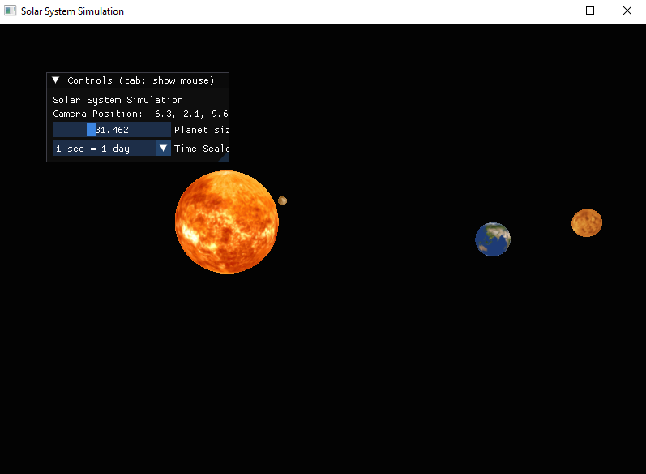

🌌 C++ OpenGL Solar System
  
This project is a Solar System simulation built using C++ and OpenGL in Visual Studio 2022. 
This project is part of my journey learning OpenGL. It's a way to apply and demonstrate what I've learned so far, and I'm excited to keep building and expanding as I continue exploring graphics programming.

🚀 Features

🌍 Realistic planetary orbits with rotation and revolution

🛠️ Camera controls for free movement and zooming

🌠 Textured planets using OpenGL shaders

🛠️ Modular code for easy expansion

📂 Project Structure

📚 SolarSystemProject  
│\── 📂 include/        # Header files  
│\── 📂 src/            # Source code (.cpp files)  
│\── 📂 dependencies/   # External libraries (GLFW, GLAD, GLM)  
│\── SolarSystem.sln    # Visual Studio solution file  
│\── .gitignore         # Ignore unnecessary files  
│\── README.md          # Project documentation  

🛠️ Installation & Setup

1. Install Dependencies

Ensure you have the following libraries:

GLFW – Window and input handling

GLAD – OpenGL function loader

GLM – Math library for 3D transformations

IMGUI - Graphical user interface library fo

2. Clone the Repository

git clone https://github.com/jeffke110/SolarSystem.git
cd SolarSystem

3. Set Up Visual Studio 2022

Open SolarSystem.sln in Visual Studio.

Configure the include directories for GLFW, GLAD, and GLM.

Set x64 Debug/Release as the target build configuration.

4. Build and Run

Press Ctrl + Shift + B to build the project.

Press F5 to run the simulation.

🎮 Controls

Key

Action

W/S

Move camera forward/back

A/D

Move camera left/right

Q/E

Rotate camera

Up/Down

Zoom in/out

Esc

Exit the program

🖼️ Screenshots

🐜 License

This project is licensed under the MIT License.

🤝 Contributing

Feel free to submit pull requests or open issues!

